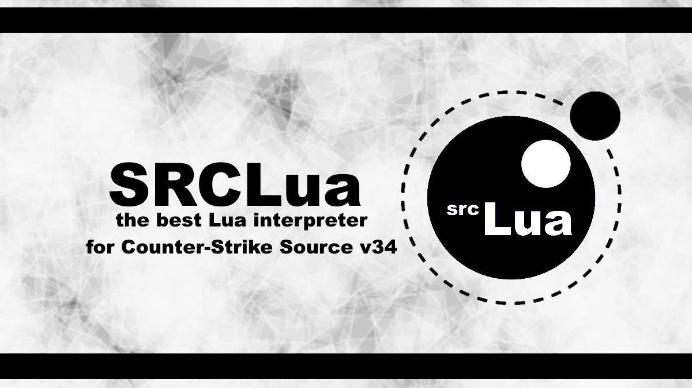

# SRCLua
by coolmen & cometype.

SRCLua — это новый Lua интерпретатор, предназначенный для Counter-Strike: Source v34. Он заменят Lua Source Scripting (LSS) от HaloShadoW своими возможностями для создания скриптов.

В этой таблице будет проведено сравнение между SRCLua и LSS, которое продемонстрирует, насколько SRCLua является более продвинутым.
---

| Возможность                                                    | SRCLua | LSS  |
|----------------------------------------------------------------|--------|------|
| **Версия Lua**                                                 | Lua 5.3 | Lua 5.1 |
| **Вывод текста в консоль**                                     | ✔      | ✔    |
| **Назначение значения консольной переменной**                  | ✔      | ✔    |
| **Получение значения консольной переменной**                   | ✔      | ✔    |
| **Выполнение команды в игровой консоли**                       | ✔      | ✔    |
| **Регистрация консольных переменных**                          | ✔      | ✖    |
| **Получение/Установка углов игрока**                           | ✔      | ✖    |
| **Создание потока выполнения**                                 | ✔      | ✖    |
| **Чтение/Запись в памяти**                                     | ✔      | ✖    |
| **Получение позиции игрока**                                   | ✔      | ✖    |
| **Получение информации об игроке**                             | ✔      | ✖    |
| **Проверка подключения к серверу**                             | ✔      | ✖    |
| **Выход из сервера с указанием причины**                       | ✖      | ✔    |

---

## Функции

### `print(message)`

Выводит текст `message` в консоль.

**Пример:**

```lua
print("Hello world!")
```

---

### `setCVar(convar, value)`

Назначает `convar` со значением `value` без каких-либо ограничений.

**Пример:**

```lua
setCVar("sv_cheats", "1")
print("Server cvar \"sv_cheats\" changed to 1")
```

---

### `getCVar(convar)`

Получает значение у `convar`.

**Пример:**

```lua
local sv_cheats = getCVar("sv_cheats")
print("sv_cheats = " .. sv_cheats)
```

---

### `cmd(command)`

Выполняет команду в игровую консоль.

**Пример:**

```lua
cmd("say Hello world!")
cmd("name MyName")
```

---

### `wait(ms)`

Делает задержку на `ms` миллисекунд.

**Пример:**

```lua
print("Ожидание...")
wait(1000) -- 1000 мс = 1 секунда
print("Прошло 1 сек!")
```

---

### `isactive()`

Возвращает `true`, если клиент полностью подключен к серверу.

**Пример:**

```lua
local ip = "127.0.0.1:27015"
cmd("connect " .. ip)
while not isactive() do
    wait(300)
end
print("Вы полностью подключились к серверу!")
```

---

### `isconnected()`

Возвращает `true`, если клиент подключен к серверу, но всё ещё загружается.

**Пример:**

```lua
local ip = "127.0.0.1:27015"
cmd("connect " .. ip)
while not isconnected() do
    wait(300)
end
print("Подключение найдено!")
```

---

### `keyDown(key)`

Проверяет нажата ли клавиша `key` или нет.

**Пример:**

```lua
while keyDown(KEY_LSHIFT) == 0 do -- ожидание нажатие клавишы
    wait(300)
end
print("Клавиша Shift нажата.")
```

**Все названия клавиш:**

| Клавиша           | Название               |
|-------------------|-------------------------|
| KEY_LEFTMOUSE     | Левая кнопка мыши       |
| KEY_RIGHTMOUSE    | Правая кнопка мыши      |
| KEY_CANCEL        | Отмена                  |
| KEY_MIDDLEMOUSE   | Средняя кнопка мыши     |
| KEY_BACKSPACE     | Backspace (Удаление)    |
| KEY_TAB           | Tab (Вкладка)           |
| KEY_ENTER         | Enter (Ввод)            |
| KEY_SHIFT         | Shift (Shift)           |
| KEY_CTRL          | Ctrl (Контроль)         |
| KEY_ALT           | Alt (Альт)              |
| KEY_PAUSEBREAK    | Пауза/Прерывание        |
| KEY_CAPSLOCK      | Caps Lock (Блокировка регистров) |
| KEY_ON            | Включение               |
| KEY_OFF           | Выключение              |
| KEY_ESC           | Escape (Эскейп)         |
| KEY_CONVERT       | Конвертировать          |
| KEY_NONCONVERT    | Не конвертировать       |
| KEY_ACCEPT        | Принять                 |
| KEY_MODECHANGE    | Смена режима            |
| KEY_SPACE         | Пробел                  |
| KEY_PAGEUP        | Page Up (Страница вверх)|
| KEY_PAGEDOWN      | Page Down (Страница вниз) |
| KEY_END           | End (Конец)             |
| KEY_HOME          | Home (Домой)            |
| KEY_LEFT          | Влево                   |
| KEY_UP            | Вверх                   |
| KEY_RIGHT         | Вправо                  |
| KEY_DOWN          | Вниз                    |
| KEY_SELECT        | Выбор                   |
| KEY_PRINT         | Печать                  |
| KEY_EXECUTE       | Выполнить               |
| KEY_PRINTSCR      | Print Screen (Скриншот) |
| KEY_INSERT        | Insert (Вставить)       |
| KEY_DELETE        | Delete (Удалить)        |
| KEY_HELP          | Help (Помощь)           |
| KEY_ZERO          | 0                       |
| KEY_ONE           | 1                       |
| KEY_TWO           | 2                       |
| KEY_THREE         | 3                       |
| KEY_FOUR          | 4                       |
| KEY_FIVE          | 5                       |
| KEY_SIX           | 6                       |
| KEY_SEVEN         | 7                       |
| KEY_EIGHT         | 8                       |
| KEY_NINE          | 9                       |
| KEY_A             | A                       |
| KEY_B             | B                       |
| KEY_C             | C                       |
| KEY_D             | D                       |
| KEY_E             | E                       |
| KEY_F             | F                       |
| KEY_G             | G                       |
| KEY_H             | H                       |
| KEY_I             | I                       |
| KEY_J             | J                       |
| KEY_K             | K                       |
| KEY_L             | L                       |
| KEY_M             | M                       |
| KEY_N             | N                       |
| KEY_O             | O                       |
| KEY_P             | P                       |
| KEY_Q             | Q                       |
| KEY_R             | R                       |
| KEY_S             | S                       |
| KEY_T             | T                       |
| KEY_U             | U                       |
| KEY_V             | V                       |
| KEY_W             | W                       |
| KEY_X             | X                       |
| KEY_Y             | Y                       |
| KEY_Z             | Z                       |
| KEY_LWIN          | Левый Win              |
| KEY_RWIN          | Правый Win             |
| KEY_APPS          | Приложения              |
| KEY_SLEEP         | Сон                     |
| KEY_NP0           | NumPad 0                |
| KEY_NP1           | NumPad 1                |
| KEY_NP2           | NumPad 2                |
| KEY_NP3           | NumPad 3                |
| KEY_NP4           | NumPad 4                |
| KEY_NP5           | NumPad 5                |
| KEY_NP6           | NumPad 6                |
| KEY_NP7           | NumPad 7                |
| KEY_NP8           | NumPad 8                |
| KEY_NP9           | NumPad 9                |
| KEY_MULTIPLY      | Умножение               |
| KEY_ADD           | Сложение                |
| KEY_SEP           | Разделитель             |
| KEY_SUBSTRACT     | Вычитание               |
| KEY_DEC           | Десятичный              |
| KEY_DIVIDE        | Деление                 |
| KEY_F1            | F1                      |
| KEY_F2            | F2                      |
| KEY_F3            | F3                      |
| KEY_F4            | F4                      |
| KEY_F5            | F5                      |
| KEY_F6            | F6                      |
| KEY_F7            | F7                      |
| KEY_F8            | F8                      |
| KEY_F9            | F9                      |
| KEY_F10           | F10                     |
| KEY_F11           | F11                     |
| KEY_F12           | F12                     |
| KEY_F13           | F13                     |
| KEY_F14           | F14                     |
| KEY_F15           | F15                     |
| KEY_F16           | F16                     |
| KEY_F17           | F17                     |
| KEY_F18           | F18                     |
| KEY_F19           | F19                     |
| KEY_F20           | F20                     |
| KEY_F21           | F21                     |
| KEY_F22           | F22                     |
| KEY_F23           | F23                     |
| KEY_F24           | F24                     |
| KEY_NUMLOCK       | Num Lock                |
| KEY_SCROLLLOCK    | Scroll Lock             |
| KEY_LSHIFT        | Левый Shift             |
| KEY_RSHIFT        | Правый Shift            |
| KEY_LCTRL         | Левый Ctrl              |
| KEY_RCTRL         | Правый Ctrl             |
| KEY_LMENU         | Левый Alt               |
| KEY_RMENU         | Правый Alt              |

---

### `ConVar(convar_name, default_value, flags, description)`

Регистрирует консольное значение.

- `convar_name` - название
- `default_value` - значение по умолчанию
- `flags` - флаги (см. ниже)
- `description` - описание

**Пример:**

```lua
ConVar("my_cvar", "1", FCVAR_NOTIFY, "The Description.")
print(getCVar("my_cvar"))
```

**Все флаги:**

| Флаг                           | Описание                                                                                         |
|--------------------------------|--------------------------------------------------------------------------------------------------|
| `FCVAR_UNREGISTERED`           | Команда не зарегистрирована и не имеет стандартного поведения в системе команд.                 |
| `FCVAR_DEVELOPMENTONLY`        | Команда доступна только в режиме разработки.                                                     |
| `FCVAR_GAMEDLL`                | Команда используется только в игровых DLL.                                                        |
| `FCVAR_CLIENTDLL`              | Команда предназначена для использования только в клиентской DLL.                                 |
| `FCVAR_HIDDEN`                 | Команда скрыта от списка доступных команд.                                                        |
| `FCVAR_PROTECTED`              | Команда защищена от изменения стандартными методами.                                              |
| `FCVAR_SPONLY`                 | Команда доступна только в однопользовательском режиме.                                            |
| `FCVAR_ARCHIVE`                | Команда сохраняется в конфигурационном файле и восстанавливается при следующем запуске игры.     |
| `FCVAR_NOTIFY`                 | При изменении команды будет отправлено уведомление.                                              |
| `FCVAR_USERINFO`              | Команда используется для хранения информации о пользователе.                                      |
| `FCVAR_PRINTABLEONLY`          | Значение команды может содержать только печатные символы.                                         |
| `FCVAR_UNLOGGED`               | Команда не будет записана в логи.                                                                 |
| `FCVAR_NEVER_AS_STRING`        | Значение команды никогда не должно быть интерпретировано как строка.                             |
| `FCVAR_REPLICATED`             | Значение команды синхронизируется между клиентом и сервером.                                     |
| `FCVAR_CHEAT`                  | Команда доступна только в режиме читов.                                                           |
| `FCVAR_DEMO`                   | Команда используется в демо-записях.                                                               |
| `FCVAR_DONTRECORD`             | Команда не будет записана в демо или лог файлы.                                                  |
| `FCVAR_RELOAD_MATERIALS`       | Команда требует перезагрузки материалов после изменения.                                          |
| `FCVAR_RELOAD_TEXTURES`        | Команда требует перезагрузки текстур после изменения.                                             |
| `FCVAR_NOT_CONNECTED`          | Команда доступна даже если клиент не подключен к серверу.                                        |
| `FCVAR_MATERIAL_SYSTEM_THREAD` | Команда используется в потоке системы материалов.                                                |
| `FCVAR_ARCHIVE_XBOX`           | Команда сохраняется в конфигурационном файле на Xbox.                                             |
| `FCVAR_ACCESSIBLE_FROM_THREADS`| Команда доступна из потоков.                                                                      |
| `FCVAR_SERVER_CAN_EXECUTE`     | Команда может быть выполнена на сервере.                                                          |
| `FCVAR_SERVER_CANNOT_QUERY`    | Команда не может быть запрошена с сервера.                                                       |
| `FCVAR_CLIENTCMD_CAN_EXECUTE`  | Команда может быть выполнена клиентом.                                                            |

---

### `getAng()`

Возвращает 3 значения углов клиента (`pitch`, `yaw`, `roll`).

**Пример:**

```lua
local pitch, yaw, roll = getAng()
print("My Pitch: " .. pitch)
print("My Yaw: " .. yaw)
print("My Roll: " .. roll)
```

---

### `setAng(pitch, yaw, roll)`

Устанавливает взгляд угла игрока. `roll` необязателен. `Pitch` - вертикальный поворот, `Yaw` - горизонтальный поворот, `Roll` - наклон камеры продольной оси.

**Пример:**

```lua
for i = 1, 36 do -- Поворот камеры на 360 градусов
    local pitch, yaw, roll = getAng()
    setAng(pitch, yaw + 10, roll)
    wait(10)
end
```

---

### `createthread(func)`

Создаёт новый поток выполнения для указанной функции `func`, позволяя
её выполнение в фоновом режиме без прерывания основного потока исполнения.

**Пример:**

```lua
createthread(function()
    for i = 1, 3 do
        print("First Thread: " .. i)
        wait(1000)
    end
end)
wait(50)
for i = 1, 3 do
    print("Second Thread: " .. i)
    wait(1000)
end
```

---

### `GetModule(dllname)`

Получает базовый адрес определённого DLL.

**Пример:**

```lua
local engine = GetModule("engine.dll")
```

---

### `memoryread(address, mode, length)`

Читает указанный адрес с определённым режимом.

- **Режимы:**
  - `int` - Читает целое число.
  - `float` - Читает число с плавающей точкой (одинарной точности).
  - `double` - Читает число с плавающей точкой (двойной точности).
  - `string` - Читает текстовую строку. В этом режиме требуется третий параметр `length`, который указывает длину строки.

**Пример:**

```lua
local engine = GetModule("engine.dll")

local offset_currentmap = 0x51FAD0

if isconnected() then
    local currentmap = memoryread(engine + offset_currentmap, "string", 260)
    print("Текущая карта: " .. currentmap)
else
    print("Вы находитесь в главном меню!")
end
```

---

### `memorywrite(address, mode, value, length)`

Записывает значение в указанный адрес с определённым режимом.

- **Режимы:**
  - `int` - Записывает целое число.
  - `float` - Записывает число с плавающей точкой (одинарной точности).
  - `double` - Записывает число с плавающей точкой (двойной точности).
  - `string` - Записывает текстовую строку. В этом режиме требуется третий параметр `length`, который указывает длину строки.

Не рекомендуется записывать значения в случайный адрес, это может сломать игру.

**Пример:**

```lua
local engine = GetModule("engine.dll")

local offset = 0x51FAD0

memorywrite(engine + offset, "string", "this is a test value", 260)
```

---

### `getPos()`

Возвращает три значения координат игрока (`x`, `y`, `z`).

**Пример:**

```lua
local x, y, z = getPos()
print("x = " .. x)
print("y = " .. y)
print("z = " .. z)
```

---

### `maxclients()`

Возвращает максимальное количество слотов (игроков) на сервере.

**Пример:**

```lua
-- Пример использования отсутствует
```

---

### `GetPlayerInfo(index)`

Получает информацию об игроке по его индексу. Возвращает таблицу с такими значениями:

- `name` - Никнейм игрока
- `userID` - Идентификатор игрока
- `guid` - Проще говоря SteamID
- `fakeplayer` - Является ли игрок ботом или нет
- `ishltv` - Если игрок является самим HLTV (SourceTV)

**Пример:**

```lua
print("Игроки на сервере:")
for i = 1, maxclients() do
    local ply = GetPlayerInfo(i)
    if ply then
        print(ply.name)
    end
end
```

---

### `wincmd(command)`

Выполняет команду в консоль Windows, но не открывает консоль (альтернатива `os.execute`).

**Пример:**

```lua
wincmd("calc") -- Открытие калькулятора.
```

---
